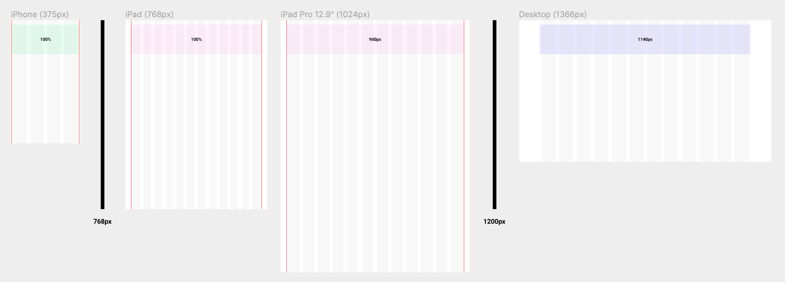

# Grid

## grid란?

‌ grid는 안정감 있고 보기 좋게 컨텐츠를 배치하기 위해 사용하는 디자인 기법입니다. 일정한 비율이 유지되므로 통일성 있어 보입니다. 이 기법을 코드로 구현해 봅시다.

## 그리드를 구성하는 요소들



* columns: 회색 기둥의 개수. 화면을 몇분할 할 수 있는지를 결정함.
* units: 회색 기둥의 너비. 한 칼럼의 너비를 계산해야 반응형에서의 대응 방법을 고려할 수 있음.
* gutter: 회색 기둥 사이의 여백. 컨텐츠들이 보통 이 gutter 간격만큼 벌어져 배치됩니다.
* margin: 빨간색 선과 화면 끝 사이의 간격. 맨 끝의 좌우 여백 같은 경우는 모바일에서 터치가 잘 안되는 부분이므로 원래 gutter보다 간격을 더 두는 경우가 있습니다.
* container: 빨간색 선 사이의 너비. 반응형에서 화면이 커져도 그리드를 꽉 채우는 버전인지, 일정 너비 이상이면 가운데로 배치되는지에 따라 컨텐츠 전체 너비의 전략이 달라집니다.

## 변수화

‌ 반응형을 모바일, 태블릿, pc버전으로 나누어서 볼건데, 이 때 고정되는 값이나 각각의 특정 값들은 변수처리를 합니다.

```scss
$gutter: 20px;
// mobile 
$sm-columns: 4; 
$sm-margin: 5px;

// tablet 
$md-columns: 12; 
$md-margin: 30px; 
$md-max-container: 960px + $md-margin * 2;

// desktop
$lg-columns: 12; 
$lg-unit: 75px; 
$lg-max-container: ($lg-unit + $gutter) * $lg-columns;
```

## 구조화

```scss
.container { 
    width: 100%; 
    padding: 0 $sm-margin; 
    margin: 0 auto;
    
    .row { display: flex; flex-wrap: wrap; }
    [class^=‘col-‘] { padding: 0 $gutter / 2; }
    
    @for $i from 1 through $sm-columns { 
        .col-sm-#{$i} { 
            width: percentage($i / $sm-columns); 
        } 
    }
    
    @include responsive(T) { 
        padding: 0 $md-margin; 
        max-width: $md-max-container;
        
        @for $i from 1 through $md-columns {
          .col-md-#{$i} {
            width: percentage($i / $md-columns);
          }
        }
    }
    
    @include responsive(D) { 
        max-width: $lg-max-container;
        padding: 0;
        
        @for $i from 1 through $lg-columns {
          .col-lg-#{$i} {
            width: ($lg-unit + $gutter) * $i;
          }
        }
    }
}
```
